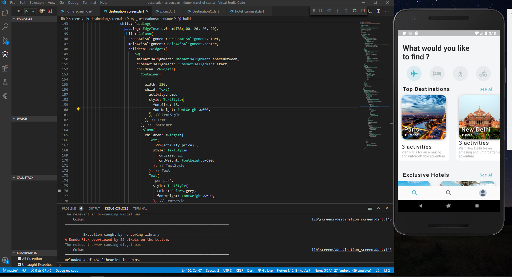
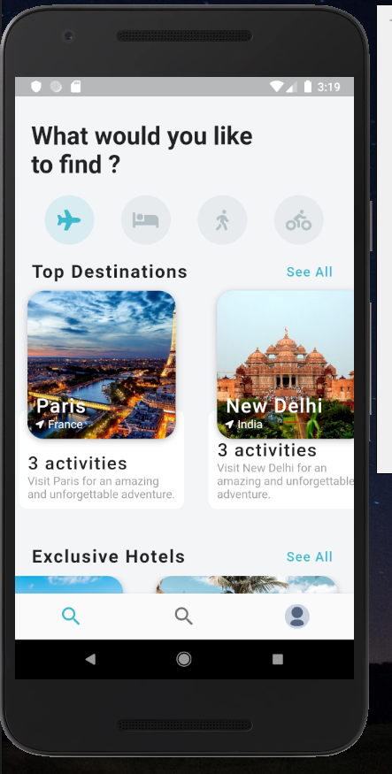
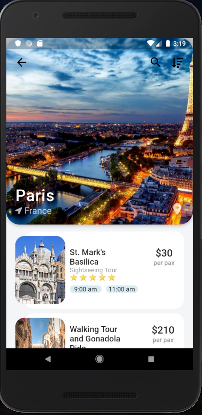
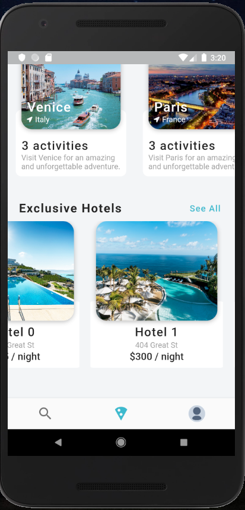

# Apps From  | Flutter Travel UI Starter Repo
I have watched the video for the devoloping this app. 
Link of video : https://www.youtube.com/watch?v=CSa6Ocyog4U&list=WL&index=38&t=3100s 

App is looking like :

